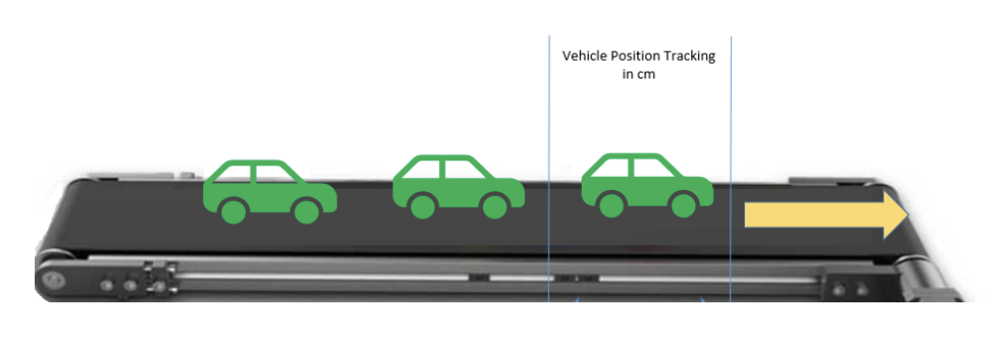

# UW Hackathon Challenge

This is my groups code for the 2 day hackathon for the Toyota Innovation Challenge.

## Background:

TMMC has vision systems on assembly line conveyors to perform vehicle quality checks. These vision systems require input from the conveyor to know when a car enters the vision station. Moreover, the vision system has multiple cameras, and each camera is required to be triggered at a certain position as the car traverses through the vision station.

## Problem:
Currently, the vision system triggers are not consistent which causes variation in images and causes false fails. To get consistent images, cameras need to be triggered precisely and repeatably when the car is in position. 

The assembly shop has different lines. Each line consists of fixed length pitches. The vehicles in the pitches can be of different lengths (multi model). Currently, the vision system uses a line encoder but due to the communication delays and some mechanical issues (such as in the carriers rocking), the vision does not precisely know the position of vehicle. 

## Requirement:
A system is required to:
- Accurately track the real-time position of vehicle in the pitch and provide trigger signals to the vision system without adding anything to the vehicle itself. 
- The system should trigger when the vehicle’s wheel reaches the trigger location on the conveyor
- Should be flexible to adjust the trigger signal timing easily
- The trigger signals should be repeatable and immune to the variations in line speed
- The system should be capable of tracking pitches of different length on various lines
- The solution should not interfere with the process/ TM interactions
- Detection method should not require physical contact with the vehicle
- The solution should not interact with the conveyor drive motor

To assist with this challenge, we have created a set of standardized validation tests of increasing difficulty.  These tests are:

